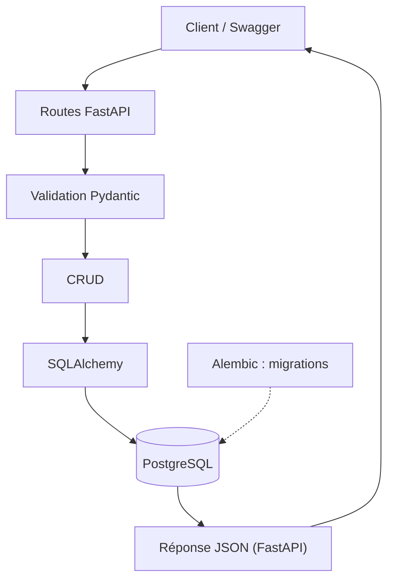

# Gestion des étudiants - API finale 1.0.0

API REST pédagogique pour inscrire, consulter, modifier et supprimer des étudiants. Les données sont conservées dans PostgreSQL. Le dernier sprint ajoute des validations, des erreurs explicites et une documentation utilisable par une autre équipe.

## Objectifs et technologies

- CRUD complet et stockage durable.
- Validation des données avec Pydantic et email-validator.
- Routes HTTP et documentation OpenAPI/Swagger avec FastAPI.
- Modèles et transactions PostgreSQL avec SQLAlchemy.
- Évolution du schéma avec Alembic.

## Structure du projet

```text
gestion_etudiants/
  app/
    __init__.py
    main.py
    database.py
    models.py
    schemas.py
    crud.py
    routers/
      __init__.py
      etudiants.py
  alembic/
    env.py
    script.py.mako
  migrations/
    0001_creer_etudiants.py
    0002_ajouter_telephone.py
  alembic.ini
  requirements.txt
  requirements-test.txt
  verifier_sprint8.py
  README.md
```

Les modules à la racine main.py, database.py, models.py et schemas.py restent des adaptateurs pour les scripts historiques. Le code de l'application est défini dans app/.

## Architecture



main.py assemble l'application ; database.py fournit et ferme les sessions ; models.py décrit les tables ; schemas.py définit les contrats de données ; crud.py traite les opérations persistantes ; routers/etudiants.py adapte leurs résultats en réponses HTTP. Une erreur pendant une écriture déclenche rollback.

## Installation

Prévoir Python 3.12 ou une version compatible et un serveur PostgreSQL. Installer PostgreSQL depuis https://www.postgresql.org/download/ ou utiliser une installation existante. Créer la base gestion_etudiants dans pgAdmin ou avec createdb.

```powershell
git clone https://github.com/visiondigitalsn-hub/gestion_etudiants.git
cd gestion_etudiants
git switch sprint-8
python -m venv env
.\env\Scripts\Activate.ps1
pip install -r requirements.txt
$env:PGHOST = '127.0.0.1'
$env:PGPORT = '5432'
$env:PGUSER = 'postgres'
$env:PGDATABASE = 'gestion_etudiants'
$sprintDbSecret = Read-Host 'Mot de passe PostgreSQL' -AsSecureString
$env:PGPASSWORD = [System.Net.NetworkCredential]::new('', $sprintDbSecret).Password
```

Une variable DATABASE_URL avec le pilote postgresql+psycopg peut remplacer ces variables. Ne publier aucun mot de passe ou URL contenant un secret.

### Nouvelle base vide

```powershell
python -m alembic upgrade head
python -m alembic current
python -m alembic check
```

### Base des sprints 4 et 5 sans historique Alembic

Le téléphone y était déjà présent. L'adoption compare le schéma au modèle avant d'enregistrer la version, sans modifier les lignes :

```powershell
python adopter_base_existante.py
python -m alembic check
```

Ne pas utiliser stamp sans cette vérification. Une base déjà versionnée se met à jour avec upgrade head. Les validations du sprint 8 portent sur le contrat API : le modèle SQL reste identique et ne demande pas de troisième migration.

## Lancement et Swagger

```powershell
uvicorn app.main:app --reload
```

- Swagger : http://127.0.0.1:8000/docs
- OpenAPI : http://127.0.0.1:8000/openapi.json
- Accueil : http://127.0.0.1:8000/

Le titre, la description, la version 1.0.0, les descriptions de modèles, les exemples et les réponses 404 sont présents dans Swagger.

## Contrat des données

| Champ | Règle |
|---|---|
| nom | Au moins 2 caractères après retrait des espaces extérieurs. |
| prenom | Au moins 2 caractères après retrait des espaces extérieurs. |
| age | Entier strictement positif ; 0 et les valeurs négatives sont refusés. |
| email | Adresse de format valide ; aucune preuve de réception ni de propriété de la boîte. |
| telephone | Facultatif ; valeur null par défaut, sans format imposé. |
| id | Entier strictement positif dans les chemins ; attribué par PostgreSQL. |

Exemple de corps POST ou PUT :

```json
{
  "nom": "Exemple",
  "prenom": "Alice",
  "age": 23,
  "email": "alice@example.com",
  "telephone": null
}
```

PUT remplace toutes les informations en conservant l'identifiant. Les champs obligatoires sont requis et le téléphone omis devient null.

## Routes et erreurs

| Méthode et chemin | Succès | Erreurs attendues |
|---|---|---|
| POST /etudiants | 201, étudiant créé | 422 si données invalides |
| GET /etudiants | 200, liste | Liste vide si aucun étudiant |
| GET /etudiants/{id} | 200 | 404 absent, 422 identifiant invalide |
| PUT /etudiants/{id} | 200 | 404 absent, 422 identifiant ou corps invalide |
| DELETE /etudiants/{id} | 204, sans corps | 404 absent, 422 identifiant invalide |

Une ressource absente retourne {"detail":"Étudiant introuvable"}. La validation retourne une liste detail avec le champ concerné dans loc, le message dans msg et le type de problème. Corriger les données indiquées avant de renvoyer la requête. Un email invalide, un âge négatif et un nom vide doivent retourner 422 sans écrire en base.

## Tests fonctionnels

```powershell
pip install -r requirements-test.txt
python verifier_sprint8.py
python verifier_sprint45.py
python verifier_sprint6.py
python verifier.py
```

Les tests utilisent PostgreSQL réel. Les nouveaux cas vérifient les rejets POST/PUT sans écriture, les identifiants invalides, les ressources absentes, le CRUD, la sérialisation et les métadonnées OpenAPI. Ils retirent seulement leurs propres étudiants fictifs. L'audit initial signale les données historiques incompatibles sans les modifier.

## Livraison et démonstration

Le code, les tests et ce guide sont sur GitHub. Les rapports et captures sont fournis séparément pour le Drive du professeur. Le support de démonstration accompagne une présentation de 12 minutes : problème, architecture, fichiers, requête complète, technologies, essais Swagger, difficultés et améliorations.

Cette API pédagogique est prévue pour une démonstration locale. Les prochaines évolutions proposées sont l'authentification, les droits d'accès, la pagination, des contraintes métier SQL, les sauvegardes et le déploiement sécurisé.
